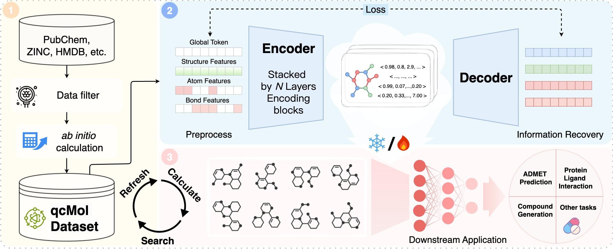

<h1 align="center">
💎 qcGEM: A Graph-based Molecular Representation   with Quantum Chemistry Awareness
</h1>

  
  
  

---

## 📘 Overview

**qcGEM** (Quantum Chemistry-aware Graph Embedding of Molecules) is a next-generation molecular representation model that integrates **quantum chemical information** with **graph neural architectures**.  
By embedding physically grounded quantum descriptors into molecular graphs, qcGEM produces **compact, interpretable, and transferable** embeddings that support a wide range of tasks in **AI-driven drug discovery**.

Pre-trained on the quantum-chemistry-annotated dataset **qcMol (1.2M molecules)**, qcGEM learns the intrinsic link between **electronic structure**, **molecular geometry**, and **global physicochemical properties**, enabling superior predictive power and physical interpretability.

---

## 🌟 Key Features

- ⚛️ **Quantum Chemistry Awareness**  
  Incorporates localized quantum descriptors (charges, bond orders, orbitals) derived from _ab initio_ calculations for physically meaningful learning.

- 🔬 **Physics-inspired Architecture**  
  Employs a global–node–edge hierarchy and multi-level attention to capture atomic, bond, and global molecular interactions.

- 🧠 **High Accuracy & Robustness**  
  Achieves **state-of-the-art** performance across **71 benchmarks**, including ADMET, activity cliffs, and protein–ligand interactions.

- 🧩 **Interpretability Across Levels**  
  Provides clear chemical interpretability at atom, bond, and molecular scales; distinguishes stereoisomers and captures non-local quantum effects.

- 🚀 **Scalable Variant – qcGEM-Hybrid**  
  A lightweight version combining _B3LYP-D3/def2-SV(P)//GFN2-xTB_ computations for faster embedding generation with minimal accuracy loss.

---

## 🧪 Citation

If you use qcGEM in your work, please cite:

> Wang, H. & Gong, H. (2025).  
> **qcGEM: a graph-based molecular representation with quantum chemistry awareness**.  
> _bioRxiv_. [https://www.biorxiv.org/content/10.1101/2025.11.02.686183v1](https://www.biorxiv.org/content/10.1101/2025.11.02.686183v1)

---

## 🌐 Resources

- 🔗 **Model resource:** Available via [Zenodo Repository](https://doi.org/10.5281/zenodo.17364257)
- 💾 **Dataset (qcMol):** [qcMol Website](https://structpred.life.tsinghua.edu.cn/qcmol/)
- 💻 **Source Code:** Coming soon at [https://github.com/qcGEM](https://github.com/qcGEM)

---

<i>qcGEM bridges quantum chemistry and machine learning — towards physically grounded AI drug discovery.</i>

