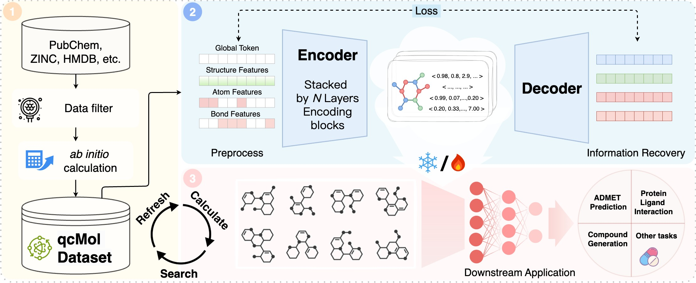

<h1 align="center">
💎 qcGEM: A Graph-based Molecular Representation <br> with Quantum Chemistry Awareness
</h1>

<p align="center">
  <a href="https://www.biorxiv.org/content/10.1101/2025.11.02.686183v1"></a>
  <a href="https://structpred.life.tsinghua.edu.cn/server_qcgem.html"></a>
  <a href="#"></a>
</p>


---

## 📘 Overview

**qcGEM** (Quantum Chemistry-aware Graph Embedding of Molecules) is a next-generation molecular representation model that integrates **quantum chemical information** with **graph neural architectures**.  
By embedding physically grounded quantum descriptors into molecular graphs, qcGEM produces **compact, interpretable, and transferable** embeddings that support a wide range of tasks in **AI-driven drug discovery**.

Pre-trained on the quantum-chemistry-annotated dataset **qcMol**, qcGEM learns the intrinsic link between **electronic structure**, **molecular geometry**, and **global physicochemical properties**, enabling superior predictive power and physical interpretability.

---

## 🌟 Key Features

- 🔬 **Physics-inspired Architecture**  
  Employs a global–node–edge hierarchy and multi-level attention to capture atomic, bond, and global molecular interactions.

- 💐 **Multiscale representations for diverse tasks**  
  Hierarchical representation modalities that directly adapt to diverse downstream task scenarios.

- ⚛️ **Quantum Chemistry Awareness**  
  Readily recovers full quantum-chemical information; readily recovers high-precision 3D geometry with folding optimizer.

- 🕵🏻‍♂️ **Comprehensive chirality differentiation**  
  Fully encodes geometry information, all chiral cases can be distinguished.

- 🏆 **High Accuracy & Robustness**  
  Achieves best performance across 83 benchmarks, including ADMET, activity cliffs, and protein–ligand interactions.

- 🔍 **Interpretability Across Levels**  
  Provides clear chemical interpretability at molecular, atom and interatom scales; captures non-local quantum effects.

- 🚀 **Scalable Variant – qcGEM-Hybrid**  
  A lightweight version combining _B3LYP-D3/def2-SV(P)//GFN2-xTB_ computations for faster embedding generation with minimal accuracy loss.

---

## 🎬 qcMol and qcGEM Framework



## 📝 Log & TODO

- Upload the embedding for direct use.

- Provide a more detailed use case with notebook.

- Upload model config.

---

## 📦 Installation

```
git clone https://github.com/GHUSER-haoyu/qcGEM.git <repo_name>

# create the conda environment
cd <repo_name>
conda create -n qcGEM python=3.8
conda activate qcGEM

# installation
conda install pytorch==2.0.0 pytorch-cuda=11.7 pyg=2.5.2 pytorch-cluster pytorch-scatter pytorch-sparse cudatoolkit=11.7 -c pytorch -c nvidia -c pyg
conda install rdkit scikit-learn scipy sympy numpy pandas tqdm h5py
conda install seaborn matplotlib

# check env list
conda list

# download and uncompress the weights and dataset, and put them in the model and data directory
mv path/of/download/weights model/
mv path/of/download/dataset data/
```

The final project structure should look like this:

```
<repo_name>
├── run
|   |── log_file
|   |── mian.py
|   |── models.py
|   |── dataset_pyg.py
|   |── ...
├── evaluation
|   |── log_file
|   |── run_ADMET.py
|   |── run_Cliff.py
|   |── models.py
|   |── dataset_pyg.py
|   |── ...
├── example
│   ├── example.ipynb
├── model
│   ├── model.ckpt
├── data
│   ├── pretrain
│   │   ├── raw
│   │   ├── processed
│   ├── evaluation
│   │   ├── ADMET
│   │   │   ├── raw
│   │   │   ├── processed
│   │   ├── Cliff
│   │   │   ├── raw
│   │   │   ├── processed
│   │   ├── PLI
│   │   │   ├── info
│   │   │   ├── raw
│   │   │   ├── processed
│   │   ├── ...
...
```

---

## 🔧 Usage

- How to install the environment?
  - Please refer to the `README.md` and `env/qcGEM_env.yml`.
- How to perform inference with your own molecule representation?
  - Please refer to `example/example.ipynb`.
- How to pretrain the model?
  - Please refer to `run/main.py`.
- How to evaluate the model?
  - Please refer to `evaluation/run_ADMET.py`.

---

## 📖 Citation

If you use qcGEM in your work, please cite:

> Wang, H. & Gong, H. (2025).  
> **qcGEM: a graph-based molecular representation with quantum chemistry awareness**.  
> _bioRxiv_. [Paper Link](https://www.biorxiv.org/content/10.1101/2025.11.02.686183v1)

---

## 🌐 Resources

- 🔗 **Model resource:** Available via [Zenodo Repository](https://doi.org/10.5281/zenodo.17364257)
- 💾 **Dataset (qcMol):** [qcMol Website](https://structpred.life.tsinghua.edu.cn/qcmol/)
- 💻 **Source Code:** [Code Link](https://github.com/GHUSER-haoyu/qcGEM)
- 🧑‍💻 **Web Server:** [Server Link](https://structpred.life.tsinghua.edu.cn/server_qcgem.html)

---

<p align="center"><i>qcGEM bridges quantum chemistry and machine learning — towards physically grounded AI drug discovery.</i></p>
